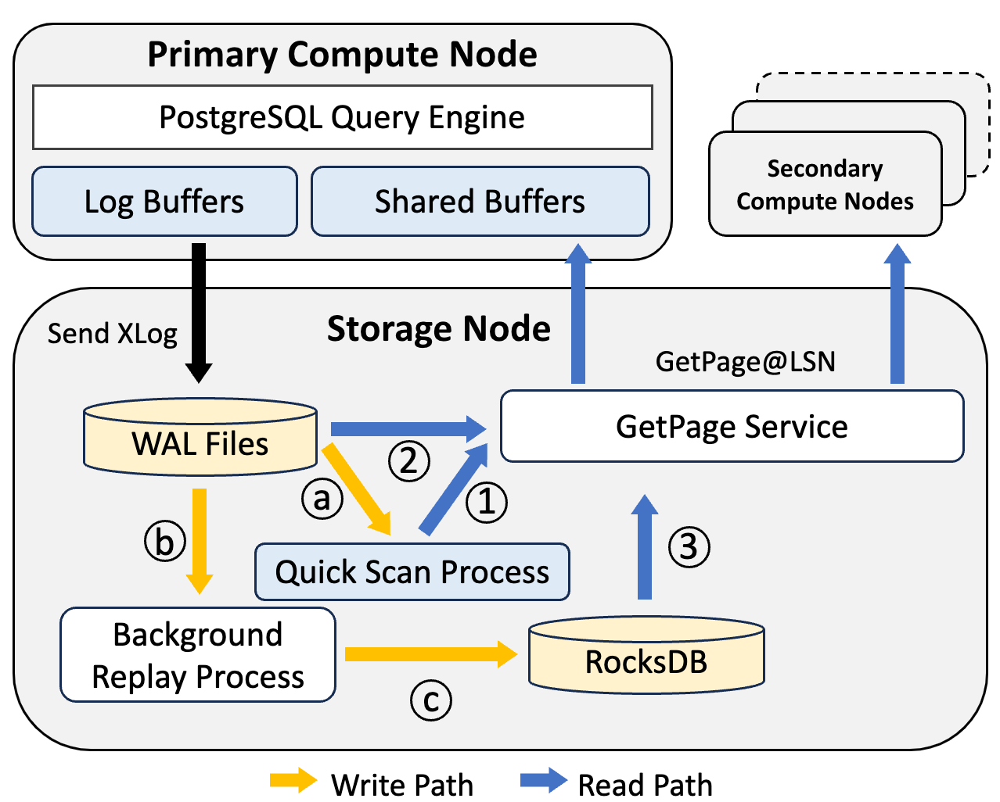

# OpenAurora

OpenAurora is a cloud-native OLTP database system prototype developed at Purdue University, based on PostgreSQL v13.0. It is an open-source version of <a href="https://dl.acm.org/doi/10.1145/3035918.3056101" target="_blank">Amazon Aurora</a>. It is designed to enable more research in cloud-native database systems for our database community.

Currently, OpenAurora supports storage disaggregation. We are investigating memory disaggregation and multi-masters within OpenAurora, but we believe this platform can support many interesting research topics in databases.


# Architecture Overview




# Implementation 
All the implementations are based on PostgreSQL v13.0. To ensure full compatibility with the PostgreSQL source code, we use C to implement kernel parts, such as xlog replaying and the multi-version storage engine. For network communication, we adopt Apache Thrift v0.14.0~\cite{Thrift}, which is a lightweight software stack for RPC implementation. To achieve compatibility with Apache Thrift, GetPage@LSN and other APIs that are closely related to RPC are implemented in C++.

## Documentations
* [Delve into LogIndex: What is LogIndex? How does it work?](docs/backend_logindex.md)
* [Pluggable KV-Store: Working with your own KVStore](docs/pluggable_kvstore.md)
* [The Truth of the Disk Disaggregation: Virtual File Descriptor](docs/virtual_file_descriptor.md)
* [Concurrency Control in Disaggregated Database : Multi-Version Page Store](docs/multi_version_page_store.md)
* [How does Compute Node directly commit XLogs to Storage Nodes?](docs/xlog_disaggregation.md)
* [Background LogIndex Vacuumer Implementation Details](docs/access_logindex_vacuumer.md)
* [What is Metadata Cache? Why does it important?](docs/relation_cache.md)
* [XLog Replay: Concurrently Replay XLog with un-multi-thread-safe XLog Replay Code](docs/wal_redo.md)
* [Backgrond XLog Replayer](docs/background_replayer.md)
* [XLog's Life Time inside Storage Node](docs/xlog_life_time.md)

## New code developed based on PostgreSQL

Here are our implemented codes that closely related with disaggregation. Note that there are many files that implemented by this project but are not included in this list. For details, please refer to our code.

```
LogDB-MV-SR
├── README.md                  # Project README file
├── include                    # Root folder for header files
│   ├── access                 # Folder for storage access layer 
│   ├── storage                # Folder for storage engine layer
│   ├── tcop                   # Folder for standalone process layer
│   ...
├── backend                    # Root folder for c source code
│   ├── logindex               # Folder for "Quick Scan" and replay
│   │   ├── logindex_hashmap.cpp            # VersionMap implementation
│   │   ├── logindex_function.cpp           # Function library for VersionMap 
│   │   ├── background_hashmap_vaccumer.cpp # VersionMap Vaccumer
│   │   ├── brin_xlog_idx.cpp     # Quick Scan and reply functions for brin index
│   │   ├── generic_xlog_idx.cpp  # Quick Scan and reply functions for generic index
│   │   ├── gin_xlog_idx.cpp      # Quick Scan and reply functions for gin index
│   │   ├── gist_xlog_idx.cpp     # Quick Scan and reply functions for gist index
│   │   ├── hash_xlog_idx.cpp     # Quick Scan and reply functions for hash index
│   │   ├── heap_xlog_idx.cpp     # Quick Scan and reply functions for head data
│   │   ├── nbtxlog_idx.cpp       # Quick Scan and reply functions for nb-tree
│   │   ...
│   ├── tramsam                # Folder for transaction related functions 
│   │   ├── xlog.c             # Logics for "Quick Scan" process
│   │   ├── xlog_insert.c      # Control how to assemble xlog ("torn page write")
│   │   ├── rmgr.c             # Control and definition for new xlog replay manager
│   │   ...
│   ├── storage                # Folder for storage interaction related functions
│   │   ├── rpc                # SubFolder for rpc logic
│   │   │   ├── rpcclient.cpp  # RPC client interfaces
│   │   │   ├── rpcserver.cpp  # GetPage@LSN logic and RPC server interfaces
│   │   │   ├── tutorial.thrift# Thrift definition for RPC service
│   │   ├── buffer             # SubFolder for buffer management
│   │   │   ├── bufmgr.c       # New RPC Buffer Eviction Protocol
│   │   │   ...
│   │   ├── file               # SubFolder for file access
│   │   │   ├── fd.c           # Multi-thread safe file access functions
│   │   │   ...
│   │   ├── kvstore            # Warpped KV-Store Functions
│   │   │   ├── kv_interface.c # Warpped KV-Store interfaces using RocksDB
│   │   │   ...
│   │   ├── rel_cache          # Folder for storage node's Relation meta data cache
│   │   │   ├── boost_shmht.cpp # Relation cache functions implemented by boost library
│   │   │   ├── builtin_shmht.cpp # Relation cache functions implemented by PostgreSQL 
│   │   │   ├── rel_cache.c    # Relation cache service logic code
│   │   │   ...
│   │   ├── smgr               # Folder for storage manager
│   │   │   ├── smgr.c         # Storage manager logic
│   │   │   ├── md.c           # Relation file access layer - md
│   │   │   ├── rpcmd.c        # Compute node's relation file access layer - rpcmd
│   │   │   ...
│   │   ├── ipc                # Folder for inter-processes communication
│   │   │   ├── ipc.c          # Shared memory registeraion 
│   │   │   ├── latch.c        # Latch implementation and registeration
│   │   │   ...
│   │   ├── sync               # Folder for synchronization among processes
│   │   │   ├── sync.c         # Sync logic for storage management among multi-process
│   │   │   ...
│   │   ...
│   ├── replication            # Folder for replica functions
│   │   ├── walreceiver.c      # Service for receiving xlogs
│   │   ├── walsender.c        # Service for sending xlogs
│   │   ...
│   ├── tcop                   # Folder for standalone process layer
│   │   ├── storage_service.c  # Storage node's startup process and communication logic
│   │   ├── walredo.c          # Multi-version xlog replay worker process
...

```

## Some important configuration locations
* **RocksDB**: You can choose your RocksDB configuration that best suits your devices. RocksDB's configuration can be found and updated in ***/backend/storage/kvstore/kv_interface.c***.
* **Torn page write**: You can enalbe or disable bypassing "torn page write" feature by adding or deleting "DISABLE_TORN_PAGE_WRITE_PROTECT" flag in ***/backend/access/transam/xlog_insert.c***.
* **Storage node's ip**: Storage node's ip should be decleard in ***/backend/access/storage/rpc/rpcclient.c*** "PRIMARY_NODE_IP" MACRO.
* **RPC server**: You can choose RPC server model and configurations. Currently, storage node RPC is using thread-pool model with default 50 pool size. You can update it in ***/backend/access/storage/rpc/rpcserver.c***.
* **multi-threads safe service**: PostgreSQL is a multi-process service. To accomodate multi-thread environment, we updated some original logic to multi-threads safe, for extar -zxvf postgresqlample, file access logic (***/backend/access/storage/file/fd.c***).  You can disable these feature using the bulit-in MACRO

# Before Installment
## PostgreSQL Source Code: [PostgreSQLv13.0](https://www.postgresql.org/ftp/source/v13.0/)
## Core Library
* RocksDB: [facebook/rocksdb](https://github.com/facebook/rocksdb)
* Boost v1.81.0: [boostorg/boost](https://github.com/boostorg/boost)
* Apache Thrift v0.14.0: [apache/thrift](https://github.com/apache/thrift)

## Other Necessary Library
> byacc, bison, flex, libssl, libsnappy, libflags, libbz2, libz4, libzstd, readline-dev

# Quick Start
## 1. Download [PostgreSQL v13.0](https://www.postgresql.org/ftp/source/v13.0/) source code.
## 2. Uncompress PostgreSQL source code 
```
 tar -zxvf postgresql-13.0.tar.gz
```
## 3. Download this project to PostgreSQL's source code
```
cd postgresql-13.0/src/
git init
git remote origin "$this_repo_address" # temporary delete because of SIGMOD anonymous policy
git fetch; git reset --hard origin/"$branch_name" # temporary delete because of SIGMOD anonymous policy
```
## 4. Compile and install this project
```
cd postgresql-13.0
# using --prefix to declare your target install directory
./configure --prefix=$YOUR_INSTALL_LOCATION LDFLAGS='-std=c++17 -lstdc++ -lrocksdb -lthrift -lrt -ldl -lsnappy -lgflags -lz -lbz2 -llz4 -lzstd -lrocksdb  -lpthread -I. -I/usr/local/include -I/usr/include -L/usr/local/lib -L/usr/bin'
make
make install
```
## 5. Initialize a database for storage node
```
cd $YOUR_INSTALL_LOCATION/bin
./initdb -D $YOUR_DATABASE_LOCATION
```
## 6. Initialize a database for compute node
```
# You can simply use scp or use initdb_comp tool provided by this project
scp $YOUR_DATABASE_LOCATION $YOUR_COMPUTE_DATABASE_LOCATION
```
## 7. Start storage node
```
# Demontrate your database location
export PGDATA="$YOUR_DATABASE_LOCATION" 
./$YOUR_INSTALL_LOCATION/bin/postgres --rpc-server
```
## 8. Start compute node
```
export RPC_CLIENT=1
./$YOUR_INSTALL_LOCATION/bin/pg_ctl -D $YOUR_COMPUTE_DATABASE_LOCATION
```
## 9. Try this disaggregated database
```
./$YOUR_INSTALL_LOCATION/bin/psql postgres
> postgres=# 
```

# Citation

If you'd like to cite OpenAurora, you may use the following:

@inproceedings{OpenAurora,

author = {Xi Pang and Jianguo Wang},

title = ,

booktitle = {Proceedings of ACM Conference on Management of Data (SIGMOD)},

year = {2024},

}

# Contact

If you have any questions, you are more than welcome to contact Dr. <a href="https://cs.purdue.edu/homes/csjgwang/" target="_blank">Jianguo Wang</a>.

