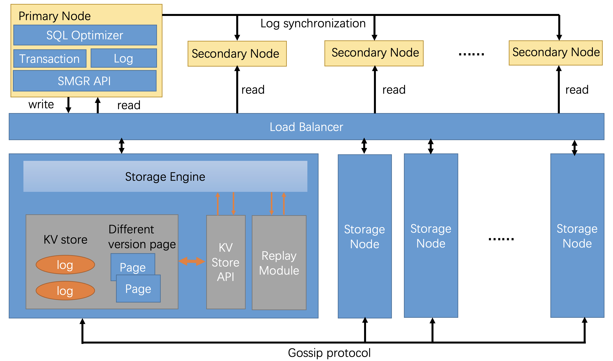

# OpenAurora: An Open-Source Cloud-Native Database System

Cloud-native databases are designed from the ground up to take the full advantage of the cloud infrastructure to provide a fully managed SQL database service in the cloud, i.e., database-as-a-service (DBaaS), to achieve the best elasticity, on-demand scaling, cost-efficiency, and etc. Examples include Amazon Aurora and Microsoft Socrates. However, a pain point is that existing cloud-native databases are all commercial products that are closed source. This prevents many possible optimizations from academia to improve and evaluate cloud-native databases. OpenAurora is an open-source version of Amazon Aurora, which is the first cloud-native OLTP database. Our hope is to provide an open platform for our database community to enable more research and optimizations in cloud-native database systems.

## Features
* Resource disaggregation
* Shared-storage architecture
* Log-is-the-database
* Asynchronous processing
* Optimized for new hardware, e.g., RDMA and 3D Xpoint
* Single-master-multi-replica

## Architecture


## Incoming Progress

### 2022/01/05
#### Goal
* Disaggregate storage layer and compute layer
#### What need to do
* Transform InitDB to create database into a remote server
* Compute node can read server node's meta data and page data
* Use postgresql replication code to connect storage node and compute node
#### Potential Risk
After decoupled compute layer and storage layer, some services like vacuum service will be temporarily unavailable. This is because they need to cooperate with compute nodes transaction information. It is acceptable these services completion to be delayed.  

### Milestone 2 (Done)
* Decouple compute from storage
* Compute node services includs: SQL parser, SQL optimizer, transaction manager, access method, execution engine, buffer memoger, replication module, storage manager API.
* Storage node services include: storage manager, replay module, vaccum service, PostgreSql storage engine.


### Milestone 3 (12/30/2021)
* Deploy a K/V store (RocksDB) inside PostgreSql.
* Transform InitDB function to initialize DB environment in K/V store.
* Implement a buffer manager in storage node.
* Replay module replays the XLog and store the pages data into K/V store.
* Storage manager read page data from K/V Store.

### Milestone 4 (02/04/2022)
* Replace metadata to K/V store.
* Apply a page MVCC in this project.

### Milestone 5 (02/22/2022)
* Support multi-user: one primary node, several replica

### Milestone 6 (03/15/2022)
* Implement distributed storage layer.
* Implement a gossip protocol to guarantee consistency among different storage nodes.
* Deploy a load balancer to balancer storage node workload. 

## Getting the source code
```bash
git clone https://github.com/px1900/OpenAurora.git
```

## Building

This project is based on [PostgreSql 13.0](https://www.postgresql.org/docs/13/release-13.html "PostgreSQL-13.0") 

* Running configure script to choose the options and configure source tree.
```bash
./configure --prefix=$your_project_dir
```
* Build project
```bash
make 
```

* Install OpenAurora
```bash
make install
```

## Create a database
Using a following command to create a database named <strong> mydb </strong>.
```bash
createdb mydb
```
If you see a message similar to:

```bash
createdb: command not found
```
then OpenAurora was not installed properly. Try calling the command with an absolute path instead:
```bash
$your_project_dir/bin/createdb mydb
```

## Access your database
You can access your database by: 

* Running a PostgreSQL interactive terminal program, which allows you to interactively enter, edit, and execute SQL commands.
* Using an existing graphical frontend tool like pgAdmin or an office suite with ODBC or JDBC support to create and manipulate a database.
* Writing a custom application, using one of the several available language bindings. You can turn to this [Tutorial](https://www.postgresql.org/docs/14/client-interfaces.html "PostgreSQL Client Interfaces").

You can access your created database via interactive terminal with the following command:
```bash
psql mydb
```


